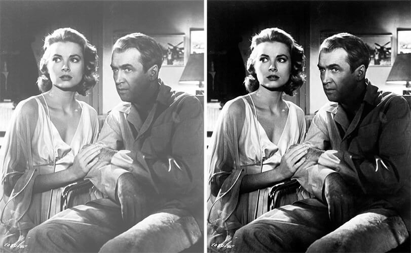
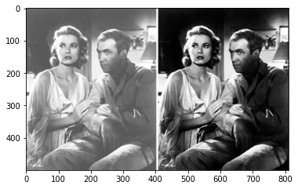
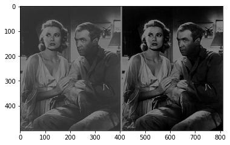

# Spatial-and-Frequency-Domain-in-Image-Processing

Low pass and High pass filtering done in both Spatial Domain and Frequency Domain. 

The biggest advantage that one gets in the frequency domain is speed, if the size of the spatial filter is big (say > 3 x 3). In frequency domain spatial convolution boils down to simple multiplication.

#Some of the advantages and disadvantages are : 
First, some spatial filters accomplish results identical to those implemented in the frequency domain, without the overhead of spatial-to-frequency conversion and back.
Second, many images do not benefit from having the same (frequency) filter applied everywhere. In order for a frequency filter to be applied only to selected localities, complex transformation is wanted, effectively doubling the filtering workload. 
While frequency domain filters can be simpler than their spatial domain equivalents, doubling (buffer thrashing) overhead for applying simpler filters can outweigh complexity cost for equivalent spatial filters whose instructions can stay cached.

#The Original Image

| Smoothening in Spatial Domain     | Sharpening in Spatial Domain     |
|------------|-------------|
| | |
|             |            |
|Smoothening in Frequency Domain    | Sharpening in Frequency Domain    |
|             |            |
| | |
|             |            |
